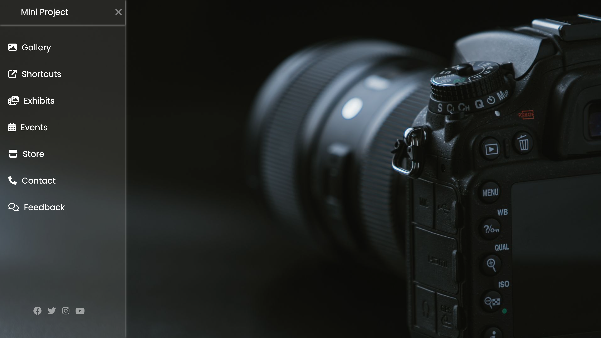

# CSS Mini Project

This repository contains a simple HTML and CSS project showcasing a sidebar menu design. The project is designed to be lightweight and demonstrate fundamental techniques in creating responsive web layouts using HTML and CSS.

## Preview



## Features

- Responsive sidebar menu
- Utilization of Font Awesome icons
- Basic hover effects

## Technologies Used

- HTML
- CSS
- Font Awesome

## Getting Started

To get a local copy up and running follow these simple steps:

1. Clone the repository:

   ```bash
   git clone https://github.com/bhupeshk3014/css-mini.git
   ```

2. Open `index.html` in your preferred browser.
